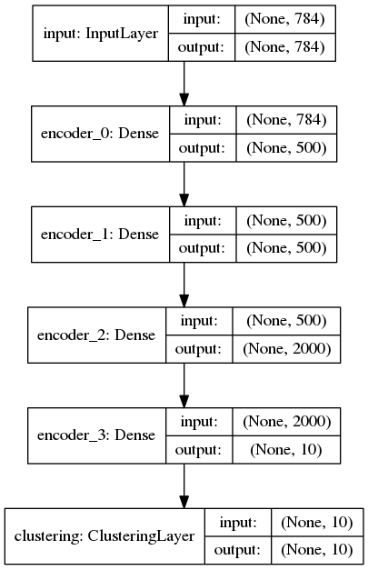

# Improved Deep Embedded Clustering (IDEC)

Keras implementation for our IJCAI-17 paper:

* Xifeng Guo, Long Gao, Xinwang Liu, Jianping Yin. 
[Improved Deep Embedded Clustering with Local Structure Preservation](https://xifengguo.github.io/papers/IJCAI17-IDEC.pdf). IJCAI 2017.

and re-implementation for paper:

* Junyuan Xie, Ross Girshick, and Ali Farhadi. Unsupervised deep embedding for clustering analysis. ICML 2016.

This code requires pretrained autoencoder weights provided. 
Use [IDEC-toy code](https://github.com/XifengGuo/IDEC-toy) for a quick start.
   

## Usage
1. Install [Keras v2.0](https://github.com/fchollet/keras), scikit-learn and git   
`sudo pip install keras scikit-learn`   
`sudo apt-get install git`
2. Clone the code to local.   
`git clone https://github.com/XifengGuo/IDEC.git IDEC`
3. Prepare datasets.    

        cd IDEC/data/usps   
        bash ./download_usps.sh   
        cd ../reuters  
        bash ./get_data.sh   
        cd ../..

4. Get pre-trained autoencoder's weights.   
Follow instructions at https://github.com/piiswrong/dec to pre-train the autoencoder.
Then save the trained weights to a keras model (e.g. mnist_ae_weights.h5) and put it in folder 'ae_weights'.  
If you do not want to install Caffe package, you can download the pretrained weights from   
https://github.com/XifengGuo/data-and-models    
Then put .h5 file in ae_weights in local folder 'ae_weights'.    
Or you can just use [IDEC-toy code](https://github.com/XifengGuo/IDEC-toy) for a quick start, but the results may be not promising.

5. Run experiment on MNIST.   
`python IDEC.py mnist --ae_weights ae_weights/mnist_ae_weights.h5`   
 or   
`python DEC.py mnist --ae_weights ae_weights/mnist_ae_weights.h5`   
The IDEC (or DEC) model is saved to "results/idec/IDEC_model_final.h5" (or "results/dec/DEC_model_final.h5").

6. Run experiment on USPS.   
`python IDEC.py usps --ae_weights ae_weights/usps_ae_weights --update_interval 30`   
`python DEC.py usps --ae_weights ae_weights/usps_ae_weights --update_interval 30`

6. Run experiment on REUTERSIDF10K.   
`python IDEC.py reutersidf10k --ae_weights ae_weights/reutersidf10k_ae_weights --n_clusters 4 --update_interval 3`   
`python DEC.py reutersidf10k --ae_weights ae_weights/reutersidf10k_ae_weights --n_clusters 4 --update_interval 20`

## Models
The DEC model:    

The IDEC model:    
